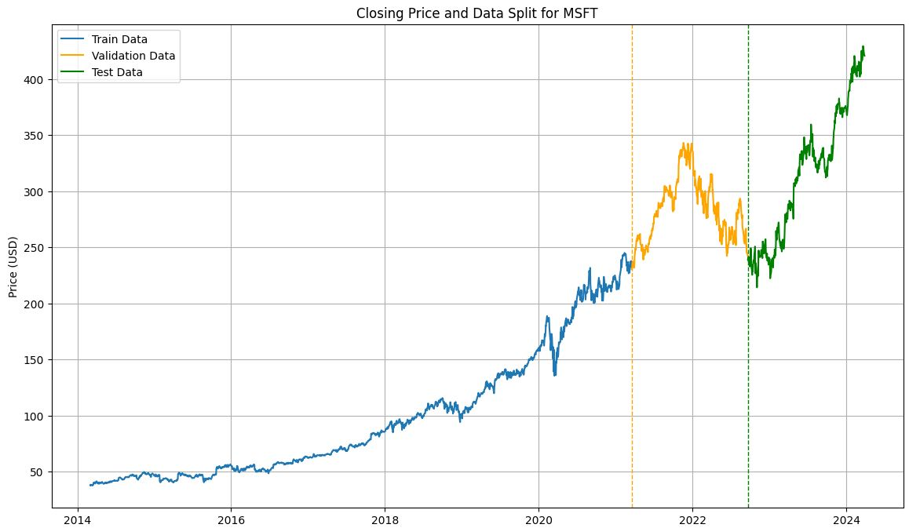
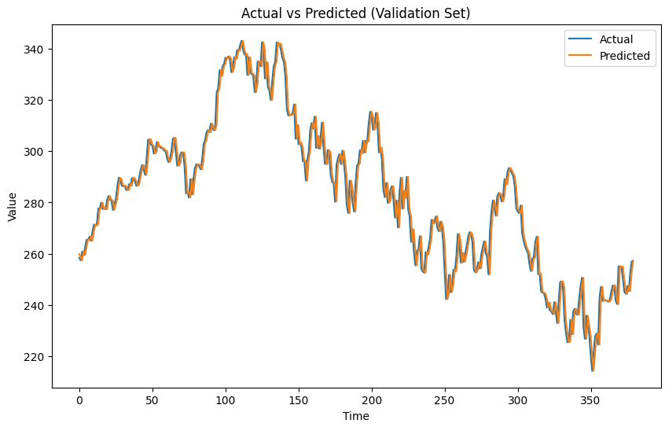

# Stock Forecasting Using RNNs

Final project - DATSCI 207  
Spring 2024  

Daniel Florencio   
David Ilitzky  
Tahlee Stone  

These document provides a very brief overview of the project. Please check the notebook for the full analysis.

## Motivation

Interest in stock market participation has surged in recent years with both retail and institutional investors seeking higher risk-adjusted returns than the market. This has been in line with record, inflation-adjusted highs observed in the US S&P 500 in 2022/24. 

Accurately predicting market behaviour could therefore provide a competitive edge, inform investment decisions and support risk management strategies. This prompts appetite for examining machine learning techniques for stock price prediction.

This project aims to leverage recurrent neural networks (RNNs), specifically LSTM and GRU frameworks, to develop a model for stock price predictions. These models are commonly used in the stock price prediction literature for their ability to handle recurrent time series data (sequential data with long-term depdencies over time) and because they address the Vanishing Gradient Problem (VGP) that is an issue for standard RNN models. Historical stock price data will be collected, preprocessed and used to train and evaluate LSTM and RNN models.

Previous studies have explored traditional (fundamental and technical analysis) and machine-learning based approaches for stock market prediction, with mixed success. Stock market prediction is recognized as one of the most relevant, but highly challenging tasks in financial research. The efficient market hypothesis (EMH) makes this a contentious space. The EMH states that price already reflects all available information and the best forecast of stock price is a random walk model (previous day's price plus noise). Over time, there has been challenges to the EMH (e.g. behavioural biases (speculative, irrational trading) and information asymmetry (insiders trading on privileged information)), but as a base case we will consider if our modelling techniques perform at least as well as a proxy for a random walk model. 

Below an overview on each section of our analysis is provided.

## Data

Historical stock price data are obtained from the `Yahoo! Finance API`.  Analysis uses Microsoft Corporation `MSFT` daily closing prices using ten years’ of data `01 Mar 2014 to 31 Mar 2024`.  

Yahoo! Finance API provides historic data for stocks, EFTs and market indices globally.  Our analysis was restricted to one stock for model development in the first instance, but can easily be extended to include other stocks in the sample later. 

The train-dev split was selected to be 70%/30%. This ensured that the training set includes sufficient time periods in the sample, out to approximately the end of 2020, which covers both upswings and downswings in the market. 
Remaining data was used to create validation and test samples. 

  

## Modeling

### Base Model  

We defined a very simple baseline model before employing machine learning techniques, a 'persistence' model that is a proxy to test for EMH. 
The persistence model simply predicts the next value in the sequence to be the same as the last value observed.

  

### Experiments

In the experiments conducted, various configurations of `LSTM - Long Short-Term Memory` and `GRU - Gated Recurrent Unit` models were evaluated. 

These experiments varied the `optimizer`, `batch size`, `learning rate`, and `sequence length` while measuring the model's performance based on the `training`, `validation`, and `test` root mean squared error (RSME).  

The results provide insights into which configurations perform best for predicting stock prices.  

The table below shows the `Experiment Configurations`.

| Model Type | Optimizer | Batch Size | Learning Rate | Sequence Length |
|------------|-----------|------------|---------------|-----------------|
| BASELINE   | -         | -          | -             | -               |
| LSTM       | Adam      | 32         | 0.001         | 60              |
| LSTM       | Adam      | 64         | 0.001         | 60              |
| LSTM       | Adam      | 32         | 0.01          | 60              |
| LSTM       | Adam      | 32         | 0.001         | 90              |
| LSTM       | SGD       | 32         | 0.001         | 60              |
| LSTM       | SGD       | 64         | 0.001         | 60              |
| LSTM       | SGD       | 32         | 0.01          | 60              |
| LSTM       | SGD       | 32         | 0.001         | 90              |
| GRU        | Adam      | 32         | 0.001         | 60              |
| GRU        | Adam      | 64         | 0.001         | 60              |
| GRU        | Adam      | 32         | 0.01          | 60              |
| GRU        | Adam      | 32         | 0.001         | 90              |
| GRU        | SGD       | 32         | 0.001         | 60              |
| GRU        | SGD       | 64         | 0.001         | 60              |
| GRU        | SGD       | 32         | 0.01          | 60              |
| GRU        | SGD       | 32         | 0.001         | 90              |

## Conclusions

From the final table below we can draw several conclusions:  

**Baseline Performance**: None of the models were able to beat the base model.  

**Optimizers Impact**: The choice of optimizer significantly affects model performance. Models trained with the `Adam` optimizer performed better compared to those trained with `SGD`, likely due to the ability of Adam to be able to update the learning rate dynamically.

**Batch Size Influence**: Across all the experiments `small (32)`  batch sizes performd better than `large (64)` batch sizes, holding everything else constant.  

**Learning Rate Sensitivity**: The learning rate also plays a crucial role. A smaller `learning rate of 0.001` yielded better results across all the experiments.  

**Sequence Length Effect**: Models trained with a `longer sequence length (90)` had higher error rates compared to those trained with `shorter sequence lengths (60)`, suggesting that longer historical data sequences might not always improve prediction accuracy.  

**Model Comparison**: The performance between `LSTM` and `GRU` models is comparable, with slight variations depending on the optimizer, batch size, learning rate, and sequence length. The `LSTM` models on avarage performed slightly better.  

**Overfitting**: There are signs of overfitting, especially noticeable in models with significantly lower training RMSE compared to validation and test RMSE. This suggests that these models might be fitting too closely to the training data and performing poorly on unseen data.  

**Recommendations**: Based on the results, it seems that models trained with the `Adam optimizer` and a `learning rate of 0.001` generally perform better. Additionally, careful consideration should be given to batch size and sequence length.  

In summary, while LSTM and GRU models show promise for stock price prediction, further optimization and fine-tuning of hyperparameters are necessary to enhance predictive accuracy.  

Additionally, it would be beneficial to explore other features to enhance the models, such as including external indexes, company specific metrics, and macroeconomic variables.  

| Model Type | Optimizer | Batch Size | Learning Rate | Sequence Length | # Parameters | Train RMSE | Validation RMSE | Test RMSE |
|------------|-----------|------------|---------------|-----------------|--------------|------------|-----------------|-----------|
| BASELINE   | -         | -          | -             | -               | -            | 2.25       | 5.28            | **4.79**  |
| LSTM       | Adam      | 32         | 0.001         | 60              | 31901        | 2.31       | 5.71            | 5.90      |
| LSTM       | Adam      | 64         | 0.001         | 60              | 31901        | 2.49       | 6.48            | 6.93      |
| LSTM       | Adam      | 32         | 0.01          | 60              | 31901        | 4.43       | 5.76            | 5.38      |
| LSTM       | Adam      | 32         | 0.001         | 90              | 31901        | 3.15       | 7.34            | 5.84      |
| LSTM       | SGD       | 32         | 0.001         | 60              | 31901        | 5.05       | 14.58           | 24.93     |
| LSTM       | SGD       | 64         | 0.001         | 60              | 31901        | 20.83      | 65.50           | 92.94     |
| LSTM       | SGD       | 32         | 0.01          | 60              | 31901        | 4.44       | 15.44           | 32.35     |
| LSTM       | SGD       | 32         | 0.001         | 90              | 31901        | 5.17       | 16.15           | 35.06     |
| GRU        | Adam      | 32         | 0.001         | 60              | 24551        | 2.54       | 6.37            | 5.46      |
| GRU        | Adam      | 64         | 0.001         | 60              | 24551        | 3.68       | 7.68            | 6.68      |
| GRU        | Adam      | 32         | 0.01          | 60              | 24551        | 2.38       | 6.41            | 15.97     |
| GRU        | Adam      | 32         | 0.001         | 90              | 24551        | 2.77       | 6.35            | 5.18      |
| GRU        | SGD       | 32         | 0.001         | 60              | 24551        | 13.05      | 37.69           | 50.47     |
| GRU        | SGD       | 64         | 0.001         | 60              | 24551        | 33.68      | 98.16           | 127.05    |
| GRU        | SGD       | 32         | 0.01          | 60              | 24551        | 2.83       | 7.54            | 8.19      |
| GRU        | SGD       | 32         | 0.001         | 90              | 24551        | 4.82       | 11.82           | 17.50     |

## Contributions

All the team members contributed equally to this project. Data selection, processing, model selection, algorithm implementations and slides were all produced as a group with equal participation.
